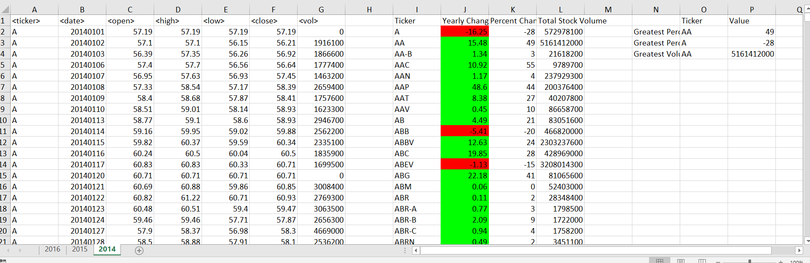
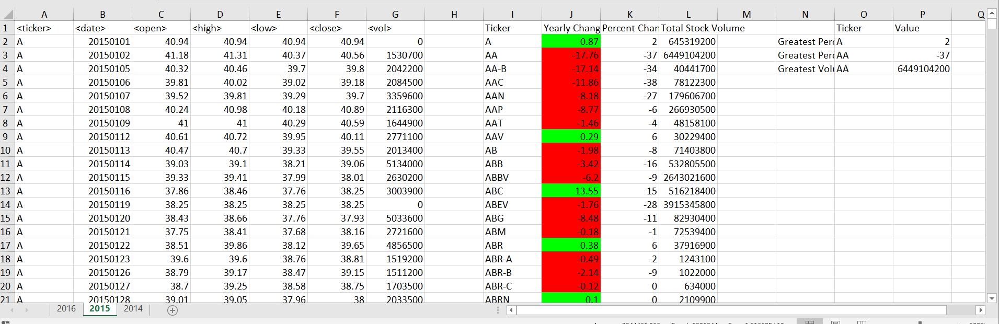
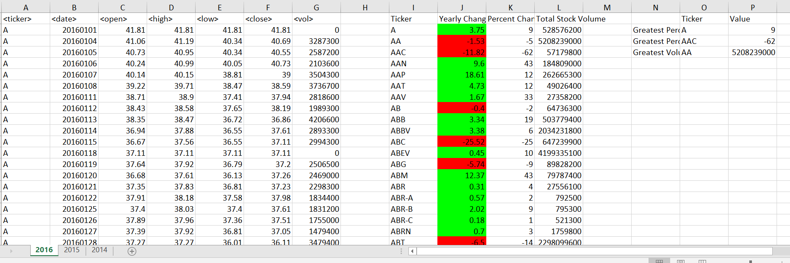

# Stock-Analysis-Sorting-VBA
Displays the increase or decrease by price or by percent for a given ticker over a given year. Also Displays the largest movers in increase, Decrease, and the biggest in volume for a year.

### Visuals:

### Sources:
Credit MultiSheet function to https://www.extendoffice.com/documents/excel/5333-excel-run-macro-multiple-sheets.html
Credit Sorting function to https://trumpexcel.com/sort-data-vba/